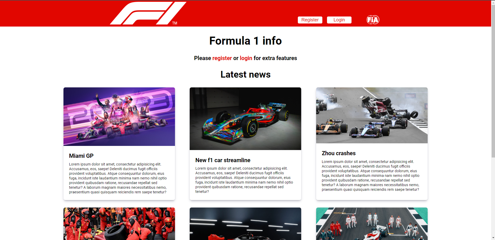

# Formula 1 web applicatie gebruiksaanwijzing

Deze applicatie is bedoeld voor de formule 1 fan. Er kan informatie opgevraagd worden aangaande de voorgaande en 
aankomende wedstrijden en standen in het klassement. Om deze pagina's te bereiken zal de gebruiker een account moeten 
aanmaken en inloggen.




## API_key

In de hoofdmap moet een bestand worden aangemaakt genaamd '.env'. In dit bestand kan de content van '.env.dist' worden
gekopieerd. Hierna moet nog de API key ingevuld worden. 

Hiervoor mag de volgende key gebruikt worden: Deze API key is te vinden in het readme.pdf bestand welke is bijgevoegd in
de eindopdracht folder

## Applicatie starten

Voordat de applicatie kan worden gestart zullen ook hier eerst alle dependencies moeten worden geïnstalleerd. Dit kan
met het commando:

```shell
npm install
```

Nadat de server is gestart kan het react project gestart worden in webstorm. Dit kan met het commando:

```shell
npm start
```
